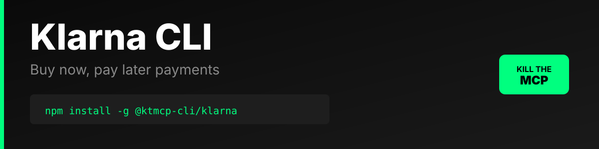

Production-ready command-line interface for the Klarna Payments API V1. Built with Commander.js for developers who prefer the power and simplicity of CLI tools over MCP servers.

> **⚠️ Unofficial CLI** - This tool is not officially sponsored, endorsed, or maintained by Klarna. It is an independent project built on the public Klarna API. Official site: https://www.klarna.com | API docs: https://docs.klarna.com/api/

## Why CLI > MCP

### Simplicity & Direct Control
- **No Server Overhead**: Direct API calls without maintaining a persistent server process
- **Zero Configuration**: Just set credentials and start making API calls
- **Shell Integration**: Pipe, redirect, and compose with standard Unix tools
- **Git-Friendly**: Command history and scripts version control beautifully

### Performance & Reliability
- **Instant Startup**: No server boot time or connection handshakes
- **Stateless**: Each command is independent, no session state to manage
- **Lightweight**: Pure Node.js with minimal dependencies
- **Predictable**: Same inputs always produce same outputs

### Developer Experience
- **Scriptable**: Write bash scripts for complex workflows
- **Composable**: Chain with jq, grep, awk for powerful data processing
- **Debuggable**: Clear error messages and exit codes
- **Portable**: Works anywhere Node.js runs, no additional infrastructure

### AI Agent Integration
- **Deterministic**: AI agents get consistent, structured output
- **Error Handling**: Proper exit codes for easy success/failure detection
- **JSON Output**: Machine-readable responses for parsing
- **Documentation**: Clear help text and examples for LLM context

## Installation

### Global Installation
```bash
npm install -g @ktmcp-cli/klarna
```

### Local Installation
```bash
npm install @ktmcp-cli/klarna
npx klarna --help
```

### From Source
```bash
git clone <repository>
cd klarna-cli
npm install
npm link
```

## Configuration

### Environment Variables
```bash
export KLARNA_USERNAME="your_username"
export KLARNA_PASSWORD="your_password"
export KLARNA_REGION="eu"  # or na, oc
export KLARNA_API_URL="https://api.klarna.com"
export KLARNA_TIMEOUT="30000"
export KLARNA_VERBOSE="false"
```

### Using .env File
Create a `.env` file in your project:
```env
KLARNA_USERNAME=your_username
KLARNA_PASSWORD=your_password
KLARNA_REGION=eu
```

### Using CLI Config
```bash
# Set credentials
klarna config set username YOUR_USERNAME
klarna config set password YOUR_PASSWORD
klarna config set region eu

# View current config
klarna config show

# Reset to defaults
klarna config reset
```

Configuration is stored in `~/.klarna/config.json`

## API Regions

- **eu**: Europe (https://api.klarna.com) - Default
- **na**: North America (https://api-na.klarna.com)
- **oc**: Oceania (https://api-oc.klarna.com)

## Usage

### Sessions

#### Create a Session
```bash
# From JSON string
klarna sessions create --data '{
  "order_amount": 10000,
  "purchase_country": "US",
  "purchase_currency": "USD",
  "order_lines": [{
    "name": "Red T-Shirt",
    "quantity": 1,
    "unit_price": 10000,
    "total_amount": 10000
  }]
}'

# From file
klarna sessions create --file session.json

# With custom region
klarna sessions create --file session.json --region na

# Verbose output
klarna sessions create --file session.json -v
```

#### Get Session Details
```bash
klarna sessions get SESSION_ID

# With verbose output
klarna sessions get SESSION_ID -v
```

#### Update Session
```bash
klarna sessions update SESSION_ID --data '{
  "order_amount": 15000,
  "order_lines": [...]
}'

# From file
klarna sessions update SESSION_ID --file updated-session.json
```

### Orders

#### Create Order from Authorization
```bash
klarna orders create AUTH_TOKEN --data '{
  "order_amount": 10000,
  "purchase_country": "US",
  "purchase_currency": "USD",
  "order_lines": [...]
}'

# From file
klarna orders create AUTH_TOKEN --file order.json
```

### Authorizations

#### Cancel Authorization
```bash
klarna authorizations cancel AUTH_TOKEN
```

#### Generate Customer Token
```bash
klarna authorizations customer-token AUTH_TOKEN

# With additional data
klarna authorizations customer-token AUTH_TOKEN --data '{
  "purchase_country": "US",
  "purchase_currency": "USD"
}'
```

## Examples

### Complete Payment Flow

```bash
# 1. Create a session
SESSION_RESPONSE=$(klarna sessions create --file session.json)
SESSION_ID=$(echo $SESSION_RESPONSE | jq -r '.session_id')

# 2. Customer completes payment (happens in your frontend)
# You receive an authorization token

# 3. Create order from authorization
klarna orders create $AUTH_TOKEN --file order.json

# 4. If needed, cancel authorization
klarna authorizations cancel $AUTH_TOKEN
```

### Using with jq for JSON Processing

```bash
# Extract specific fields
klarna sessions get $SESSION_ID | jq '.client_token'

# Create session and extract session_id
klarna sessions create --file session.json | jq -r '.session_id' > session_id.txt

# Pipe to file
klarna sessions get $SESSION_ID > session_details.json
```

### Batch Processing

```bash
# Process multiple sessions
for session_id in $(cat session_ids.txt); do
  klarna sessions get $session_id >> all_sessions.json
done

# Create orders from multiple auth tokens
while read auth_token; do
  klarna orders create $auth_token --file order_template.json
done < auth_tokens.txt
```

### Error Handling in Scripts

```bash
#!/bin/bash

if klarna sessions create --file session.json; then
  echo "Session created successfully"
  exit 0
else
  echo "Failed to create session"
  exit 1
fi
```

## Sample JSON Files

### session.json
```json
{
  "order_amount": 10000,
  "purchase_country": "US",
  "purchase_currency": "USD",
  "order_lines": [
    {
      "type": "physical",
      "name": "Red T-Shirt",
      "quantity": 1,
      "unit_price": 10000,
      "tax_rate": 0,
      "total_amount": 10000,
      "total_tax_amount": 0
    }
  ],
  "billing_address": {
    "given_name": "John",
    "family_name": "Doe",
    "email": "john@example.com",
    "street_address": "123 Main St",
    "postal_code": "12345",
    "city": "New York",
    "region": "NY",
    "phone": "+15551234567",
    "country": "US"
  }
}
```

### order.json
```json
{
  "order_amount": 10000,
  "purchase_country": "US",
  "purchase_currency": "USD",
  "order_lines": [
    {
      "type": "physical",
      "name": "Red T-Shirt",
      "quantity": 1,
      "unit_price": 10000,
      "tax_rate": 0,
      "total_amount": 10000,
      "total_tax_amount": 0
    }
  ],
  "merchant_urls": {
    "confirmation": "https://example.com/confirmation",
    "authorization": "https://example.com/authorization"
  }
}
```

## Exit Codes

- `0`: Success
- `1`: Error (API error, validation error, or runtime error)

## Error Messages

The CLI provides clear error messages:
- Missing credentials
- Invalid JSON
- API errors with status codes
- Missing required fields
- Network errors

## Authentication

Klarna Payments API uses HTTP Basic Authentication. Provide credentials via:

1. **Environment variables** (recommended for production)
2. **Config file** (`~/.klarna/config.json`)
3. **Command-line options** (not recommended, credentials visible in shell history)

```bash
# Not recommended (visible in shell history)
klarna sessions create --username USER --password PASS --file session.json
```

## API Response Format

All commands return JSON responses from the Klarna API or formatted error messages:

### Success Response
```json
{
  "session_id": "abc-123-def-456",
  "client_token": "token_value",
  "order_amount": 10000,
  ...
}
```

### Error Response
```
✗ Failed to create session (400)
Constraint violation: Invalid purchase_country
```

## Development

### Run Tests
```bash
npm test
```

### Run Locally
```bash
node bin/klarna.js --help
```

### Debug Mode
```bash
export KLARNA_VERBOSE=true
klarna sessions create --file session.json
```

## Troubleshooting

### Authentication Errors
```
Error: Authentication credentials not found
```
**Solution**: Set `KLARNA_USERNAME` and `KLARNA_PASSWORD` environment variables or use `klarna config set`

### Invalid JSON
```
Error: Unexpected token in JSON
```
**Solution**: Validate your JSON with `jq` or an online validator

### Timeout Errors
```
Error: No response from server
```
**Solution**: Increase timeout with `klarna config set timeout 60000` or check network connectivity

### Region Issues
```
Error: Failed to create session (403)
```
**Solution**: Verify you're using the correct region for your account (`--region eu/na/oc`)

## API Documentation

- [Klarna Payments API](https://docs.klarna.com/api/payments/)
- [API Reference](https://developers.klarna.com/api/)
- [Authentication](https://developers.klarna.com/documentation/klarna-payments/authentication/)

## Support

- GitHub Issues: [Report bugs or request features]
- Documentation: See `AGENT.md` for AI agent integration
- OpenClaw Integration: See `OPENCLAW.md`

## License

MIT

## Contributing

Contributions welcome! Please read the contributing guidelines before submitting PRs.

---

Built with Commander.js • Powered by Klarna Payments API V1
